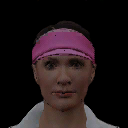
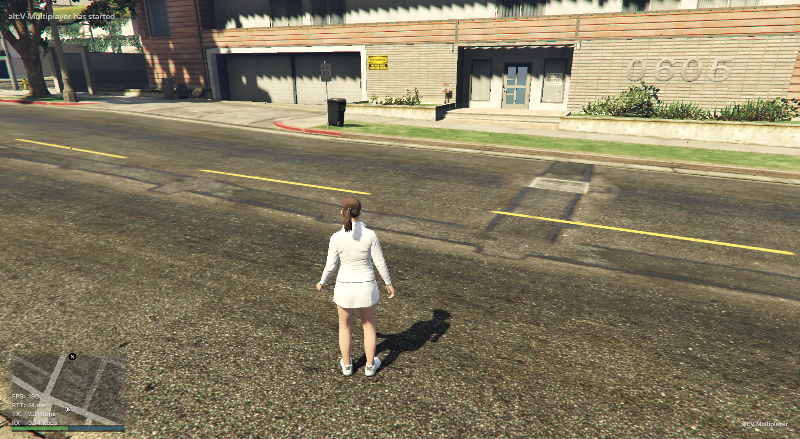
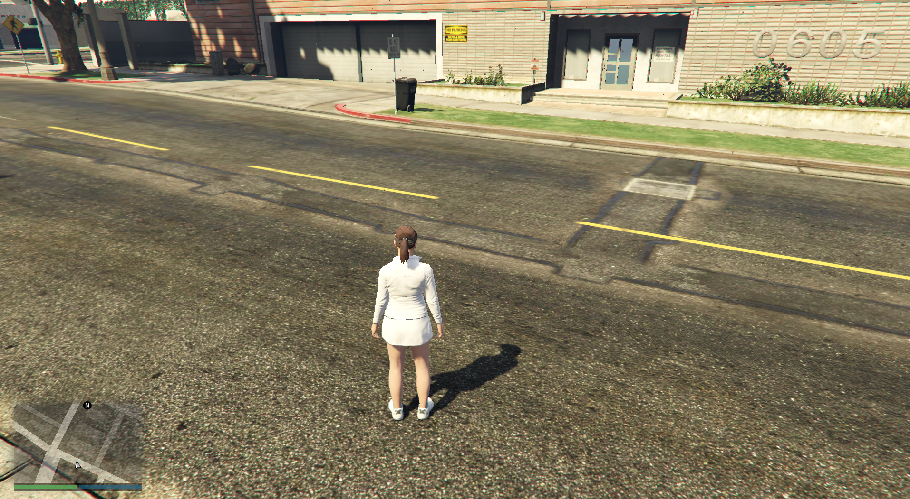

# websocket-screenshot-altv Resource
Example alt:V Multiplayer resource for alt-websocket and alt-sceenshot api

This resource will send a screenshot base64 string to the server through the alt-websocket api and will save it into a screenshot directory in the server folder.

### Getting Started
1.
```
npm install --save ws in your project
```
2.
```
copy the screenshot-ws directory to ur resources
```
3.
```
write the "screenshot-ws" as a module in ur server.cfg
```

## Example Usage:
```
1. Press the F5-Key (screenshot with cef), F4-Key (ped headshot) or F3-Key (screenshot without cef) ingame
2. You will see a screenshot directory in ur server root and a .png file in it
3. File name is alt:V Nickname + ISODate components
4. Voilá, enjoy ur first altv-round-tripped screenshot
```

## CAUTION!!:
```
This example uses the ws protocol make sure to use the wss protocol if this feature is available on release branch!
```

Ped Headshot:


Screenshot with CEF captured:


Screenshot without CEF captured:


* ** Alessandro Lion (t4styy)** - *Initial work* - [t4styy](https://github.com/tastydev)
